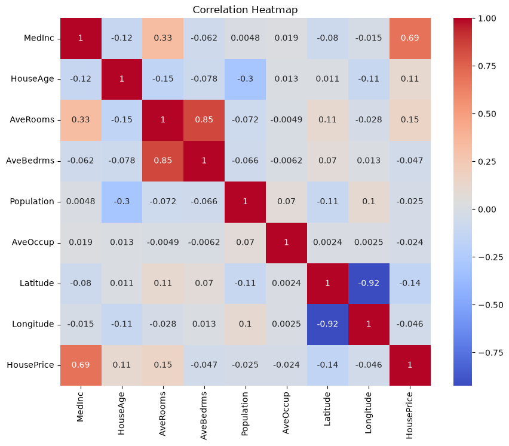
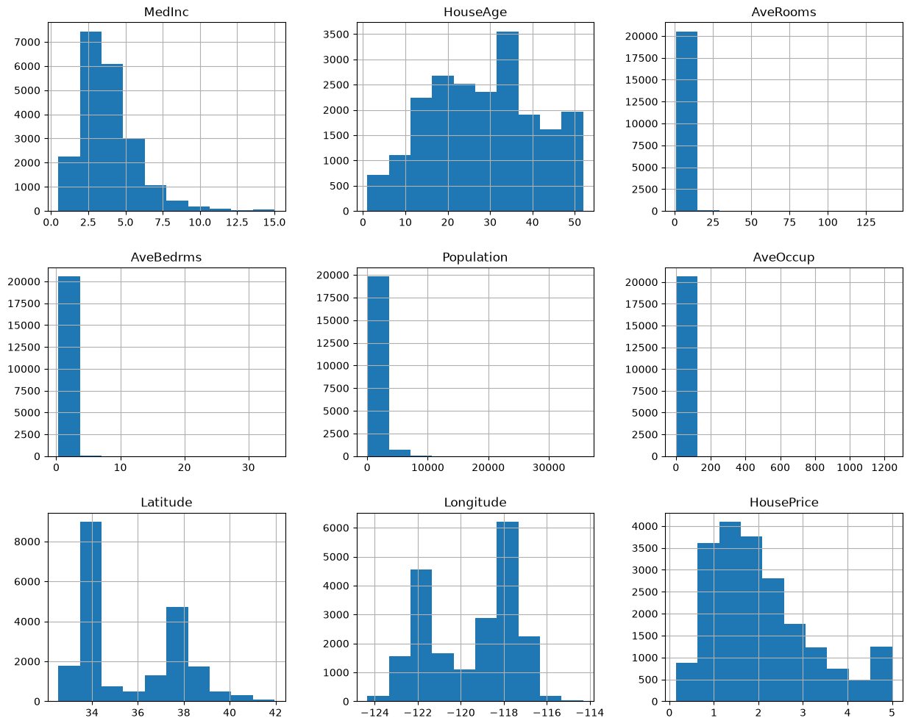
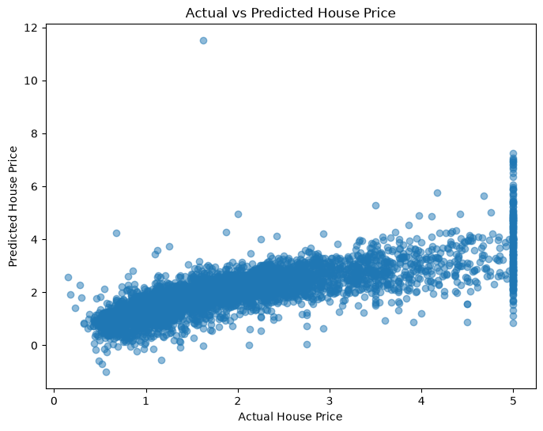
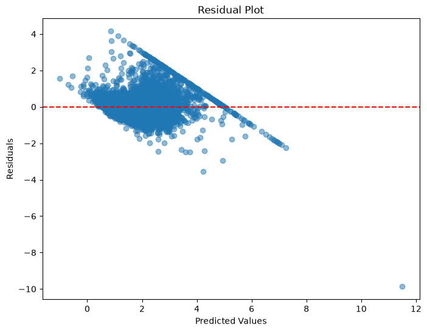

# 🏠 House Price Prediction using Linear Regression

> **Artificial Intelligence & Machine Learning Internship – Task 1**

A machine learning project that predicts California house prices using the **Linear Regression** algorithm from Scikit-learn. The project demonstrates the complete machine learning pipeline, from data exploration to model evaluation.

---

# 📌 Project Overview

The objective of this project is to build and evaluate a Linear Regression model capable of predicting house prices using the California Housing Dataset.

The project covers:

- 📊 Exploratory Data Analysis (EDA)
- 🧹 Data Preparation
- 🤖 Linear Regression Model Training
- 📈 Prediction
- 📉 Model Evaluation
- 📷 Visualization of Results

---

# 🛠 Technologies Used

| Technology | Purpose |
|------------|---------|
| Python | Programming Language |
| Jupyter Notebook | Development Environment |
| Pandas | Data Analysis |
| NumPy | Numerical Computation |
| Matplotlib | Data Visualization |
| Seaborn | Statistical Visualization |
| Scikit-learn | Machine Learning |

---

# 📂 Dataset

**Dataset:** California Housing Dataset

**Source:** Scikit-learn (`fetch_california_housing()`)

### Features

- Median Income
- House Age
- Average Rooms
- Average Bedrooms
- Population
- Average Occupancy
- Latitude
- Longitude

### Target

**Median House Value**

---

# ⚙️ Project Workflow

```text
Load Dataset
      │
      ▼
Exploratory Data Analysis
      │
      ▼
Prepare Features & Target
      │
      ▼
Train-Test Split
      │
      ▼
Train Linear Regression Model
      │
      ▼
Predict House Prices
      │
      ▼
Evaluate Model
      │
      ▼
Visualize Results
```

---

# 📊 Exploratory Data Analysis

## Correlation Heatmap

Shows the relationship between all numerical features.



---

## Feature Histograms

Displays the distribution of every feature in the dataset.



---

# 🤖 Model Training

The dataset was divided into:

- **80% Training Data**
- **20% Testing Data**

The model was trained using the **Linear Regression** algorithm provided by Scikit-learn.

---

# 📈 Model Evaluation

The model performance was evaluated using:

- Mean Absolute Error (MAE)
- Root Mean Squared Error (RMSE)
- R² Score

---

# 📉 Results

## Actual vs Predicted Values

Comparison between actual house prices and model predictions.



---

## Residual Plot

Residual analysis of the trained Linear Regression model.



---

# 📁 Project Structure

```text
House-Price-Prediction-Linear-Regression/
│
├── task1_ml_linear_regression.ipynb
├── predict_house_price.py
├── house_price_model.pkl
├── AI_Internship_Task1_Report.pdf
├── README.md
├── requirements.txt
└── Images/
    ├── correlation_heatmap.png
    ├── feature_histograms.png
    ├── actual_vs_predicted.png
    └── residual_plot.png
```

---

# ▶️ Installation

Clone the repository

```bash
git clone https://github.com/Satyavatsa/House-Price-Prediction-Linear-Regression.git
```

Go to the project folder

```bash
cd House-Price-Prediction-Linear-Regression
```

Install the required libraries

```bash
pip install -r requirements.txt
```

Run the Jupyter Notebook

```bash
jupyter notebook
```

Open

```
task1_ml_linear_regression.ipynb
```

Run all cells.

---

# 📚 Learning Outcomes

Through this project, I learned:

- Machine Learning Workflow
- Exploratory Data Analysis (EDA)
- Feature Selection
- Linear Regression
- Model Evaluation
- Data Visualization
- Git & GitHub

---

# 👨‍💻 Author

**Satyam Kumar**

B.Tech Computer Science & Engineering

Institute of Technical Education and Research (ITER)

Siksha 'O' Anusandhan University

---

# 📄 License

This project is developed for educational and internship purposes.